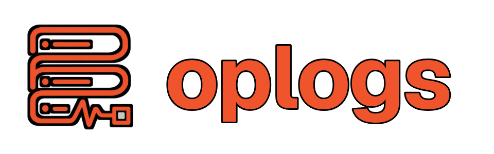

<p align="center">
  
</p>

<p align="center">
  <strong>Local-first experiment tracking for models, agents, and generated media.</strong>
</p>

<p align="center">
  <a href="https://cneuralnetwork.github.io/oplogs-docs/">Documentation</a>
</p>

oplogs keeps runs on your workstation and serves the dashboard from localhost. It
requires no account, API key, or hosted service.

## Start in two lines

Install from a clone while the package is not yet on PyPI:

```bash
pip install -e .
```

```python
import oplogs
run = oplogs.init(project="vision-lab")
```

The first run starts a persistent localhost daemon and opens the dashboard when a
desktop session is available. The Python process automatically records environment,
packages, source and Git state, console output, process and GPU telemetry, framework
metadata, exceptions, and the final run state.

Log semantic values through one method:

```python
run.log(
    {
        "train/loss": loss,
        "samples": oplogs.Image(image, caption="step 400"),
        "predictions": oplogs.Table(rows),
        "distribution": oplogs.Histogram(values),
        "checkpoint": oplogs.Artifact("model.pt", artifact_type="model", aliases=["candidate"]),
    },
    step=400,
)
```

`Run.log` accepts scalars, text, dictionaries, sequences, paths, images, audio, video,
tables, JSON, histograms, and typed artifacts. Files are content-addressed by SHA-256
and deduplicated in the local blob store.

## Run the real CNN proof

`examples/simple_cnn.py` trains a two-layer PyTorch CNN with backpropagation on a
locally generated image classification task. It records epoch metrics, optimizer
learning rate, sampled gradients, console output, process telemetry, a prediction
table, confidence histogram, image grid, trace, and reloadable model checkpoint.
No dataset download is required.

```bash
uv pip install --python .venv/bin/python torch \
  --index-url https://download.pytorch.org/whl/cpu
.venv/bin/python examples/simple_cnn.py
```

The script prints the exact localhost run URL when training finishes.

### Tiny GPU run under a 500 MB VRAM ceiling

`examples/tiny_gpu_cnn.py` is the CUDA-first dashboard demo. The model has only
1,122 trainable parameters and learns from generated 28 x 28 stripe images. It opens
the exact run page immediately, logs live batch and epoch metrics, sampled gradients,
process VRAM, predictions, sample images, and a reloadable checkpoint.

The default run caps PyTorch's caching allocator at 96 MiB. It also checks this
Python process through `nvidia-smi` during training and fails closed if measured
process VRAM exceeds 500 MiB. CUDA context memory varies by driver, so the script
verifies the real process total instead of claiming that tensor allocation is the
whole VRAM footprint.

Install a CUDA-enabled PyTorch build appropriate for your machine, then run:

```bash
.venv/bin/python examples/tiny_gpu_cnn.py
```

The generated checkpoint and sample grid are retained under
`./oplogs-cnn-output/<run-id>/`. Use `--no-open-dashboard` if you only want the URL
printed, or change the guard explicitly with `--vram-limit-mb` and
`--allocator-limit-mb`.

## Framework and agent support

Autologging is enabled by default and activates only when a supported library is
imported:

- PyTorch optimizer learning rates, CUDA metadata, and optional parameter or gradient
  telemetry through `run.watch(model)`
- Keras epoch metrics
- Lightning callback metrics
- Hugging Face Trainer logs
- scikit-learn fitted estimator classes and parameters
- JAX device and runtime metadata
- OpenAI, Anthropic, LiteLLM, LangChain, and LlamaIndex call traces
- OpenTelemetry spans through `oplogs.enable_otel()` when `oplogs[otel]` is installed

Framework wrappers resolve the active run at call time, so sequential runs in one
Python process do not leak telemetry into a finished run. oplogs never invents a loss
or score that the framework does not expose. Use `run.log` for task-specific metrics.

Functions and agent operations can be traced directly:

```python
@oplogs.trace(name="agent.plan")
def plan(request):
    return planner(request)
```

Nested spans preserve parentage, duration, status, truncated inputs and outputs, and
errors. Secret-shaped fields and token values are recursively redacted before events
leave the SDK process.

## Dashboard

The dashboard includes:

- project and run tables with search and project filters
- downsampled metric charts built for long histories
- image, audio, video, text, JSON, table, and histogram samples
- console and exception logs
- host, process, and accelerator charts
- nested LLM and agent traces
- source, Git, environment, and package evidence
- a content-addressed artifact browser and versioned local registry
- local grid, random, and Optuna TPE Bayesian sweeps
- editable reports with self-contained HTML export and optional PDF export
- visible storage usage, alerts, health checks, and index repair

The UI is compiled into the Python wheel. There is no separate dashboard service.

## Sweeps

```yaml
project: vision-lab
name: learning-rate
method: bayesian
count: 20
concurrency: 2
gpus: [0, 1]
metric:
  name: validation/loss
  goal: minimize
parameters:
  learning_rate:
    min: 0.00001
    max: 0.01
    log: true
  batch_size:
    values: [16, 32, 64]
```

```bash
oplogs sweep sweep.yaml python train.py
```

Each trial is an isolated subprocess. oplogs injects the selected configuration,
sweep ID, trial index, and optional GPU assignment into the child environment. Grid
and random trials can run concurrently. Bayesian sweeps use real Optuna TPE `ask` and
`tell` batches and read the configured objective from the retained run summary.

## W&B migration

Portable JSON exports and ordinary W&B run directories can be imported without a W&B
service:

```bash
oplogs import-wandb ./wandb/run-20260815 --project migrated
```

The importer preserves config, numeric history, summary values, tags, and files under
the run's `files` tree. Imported media is immediately visible in samples and artifacts.

## Local security and durability

- The daemon binds only to `127.0.0.1`.
- Mutating API calls require a random capability token stored with mode `0600`.
- The dashboard is same-origin and exposes no CORS permission.
- Event journals are append-only JSONL with per-event SHA-256 checksums.
- SQLite is a rebuildable query index, not the canonical event record.
- Event batches use one journal sync and one SQLite transaction.
- Source snapshots exclude VCS data, environments, dependency trees, and build caches.
- Secret keys, bearer tokens, provider keys, private-key markers, and nested request
  fields are redacted before persistence.
- Runs are never deleted automatically.

Useful commands:

```bash
oplogs open
oplogs doctor
oplogs storage
oplogs rebuild
oplogs alert --event exception
oplogs report-export REPORT_ID report.html
oplogs stop
```

## Development and verification

```bash
uv sync --extra dev --extra sweeps
uv run ruff check src tests scripts
uv run pytest
npm --prefix web install
npm --prefix web run build
uv build
```

Run the retained ingestion benchmark with:

```bash
.venv/bin/python scripts/benchmark_ingest.py --events 100000
```

The project is licensed under the MIT License.
